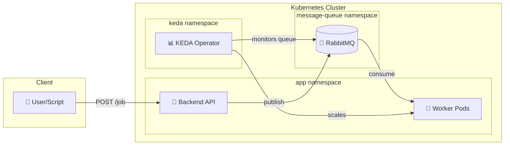

# DevOps Lab - Local Kubernetes Learning Environment

A complete local DevOps lab featuring k3d, ArgoCD, Prometheus, Grafana, and a 3-tier demo application with full observability.

## Quick Start

1. **Configure your environment:**
   ```bash
   # Edit config.env with your settings (GitHub URL, passwords, etc.)
   vim config.env
   ```

2. **Create the cluster:**
   ```bash
   ./01-setup-cluster.sh
   ```

3. **Install GitOps & Monitoring tools:**
   ```bash
   ./02-install-tools.sh
   ```

4. **Deploy the demo application:**
   
   **Option A: Manual Deployment (Script)**
   Good for local development loop.
   ```bash
   ./03-deploy-app.sh
   ```

   **Option B: GitOps Deployment (ArgoCD)**
   Good for testing the full CD pipeline.
   1. Ensure code is pushed to your Git repo.
   2. Edit `config.env` and set `GIT_REPO_URL` to your repo.
   3. Apply the Application manifest:
      ```bash
      # First, build and import images (if not done)
      ./03-deploy-app.sh --build-only  # You might need to edit script to support this or just let it run
      
      # Apply ArgoCD Application
      kubectl apply -f gitops-root/application.yaml
      ```
   4. Sync via ArgoCD UI at http://argocd.localhost

5. **Add hostnames to /etc/hosts:**
   ```bash
   echo "127.0.0.1 app.localhost api.localhost argocd.localhost grafana.localhost" | sudo tee -a /etc/hosts
   ```

## Configuration

All configurable values are in `config.env`. Key settings:

| Variable | Description | Default |
|----------|-------------|---------|
| `CLUSTER_NAME` | k3d cluster name | `devops-lab` |
| `SERVER_COUNT` | Master nodes | `1` |
| `AGENT_COUNT` | Worker nodes | `3` |
| `GIT_REPO_URL` | Your GitHub repo for GitOps | `https://github.com/YOUR_USERNAME/devops-labs.git` |
| `DB_PASSWORD` | PostgreSQL password | `apppassword` |
| `GRAFANA_ADMIN_PASSWORD` | Grafana password | `admin` |

## Service URLs

| Service | URL | Credentials |
|---------|-----|-------------|
| Frontend | http://app.localhost | - |
| Backend API | http://api.localhost | - |
| ArgoCD | http://argocd.localhost | `admin` / (auto-generated) |
| Grafana | http://grafana.localhost | `admin` / `admin` |
| RabbitMQ | http://rabbitmq.localhost | (auto-generated, see install output) |

## Project Structure

```
devops-labs/
├── config.env              # ⚙️  Configuration file (edit this!)
├── 01-setup-cluster.sh     # Creates k3d cluster
├── 02-install-tools.sh     # Installs ArgoCD, Prometheus, KEDA, RabbitMQ Operator
├── 03-deploy-app.sh        # Builds and deploys the app (manual path)
├── 04-chaos-test.sh        # 🐒 Chaos Monkey resilience tests
├── 05-k8s-compat-test.sh   # 🔄 K8s version compatibility matrix
├── spam_jobs.sh            # 📈 Load generator for KEDA scaling demo
├── src/
│   ├── backend/            # FastAPI + Prometheus + RabbitMQ producer
│   ├── frontend/           # Nginx + HTML/JS
│   └── worker/             # RabbitMQ consumer (KEDA scaled)
├── k8s/                    # 📦 All Kubernetes manifests
│   ├── app/                # Application (used by 03-deploy-app.sh)
│   ├── infrastructure/     # RabbitMQ cluster
│   ├── logging/            # Loki datasource
│   ├── argocd-ingress.yaml
│   └── grafana-ingress.yaml
└── gitops-root/            # 🔄 ArgoCD GitOps
    ├── application.yaml    # ArgoCD Application CR
    └── templates/          # Synced by ArgoCD
```

**Two deployment paths:**
- **Manual**: `./03-deploy-app.sh` → deploys from `k8s/app/`
- **ArgoCD**: `kubectl apply -f gitops-root/application.yaml` → syncs from `gitops-root/templates/`

## Prerequisites

- Docker
- k3d
- kubectl
- Helm 3

## Event-Driven Autoscaling with KEDA

This lab demonstrates **queue-based autoscaling** using [KEDA](https://keda.sh) and RabbitMQ.

### Architecture



### How It Works

1. **Backend** exposes `POST /job` endpoint that publishes messages to RabbitMQ `work_queue`
2. **KEDA** monitors the queue length every 5 seconds
3. **ScaledObject** triggers scaling: 1 worker per 5 messages (max 10 workers)
4. **Worker** consumes messages with 2-second processing delay, then ACKs
5. After queue drains, workers scale back to 0 (30s cooldown)

### Scaling Configuration

| Setting | Value | Description |
|---------|-------|-------------|
| `minReplicaCount` | 0 | Scale to zero when idle |
| `maxReplicaCount` | 10 | Maximum worker pods |
| `pollingInterval` | 5s | Queue check frequency |
| `cooldownPeriod` | 30s | Wait before scaling down |
| `value` | 5 | Messages per worker |

### Demo: Watch Workers Scale

```bash
# Terminal 1: Watch pods
kubectl get pods -n app -w

# Terminal 2: Generate load (500 jobs)
./spam_jobs.sh

# Browser: RabbitMQ dashboard
open http://rabbitmq.localhost
```

**Expected behavior:**
1. Queue spikes to ~500 messages
2. Workers scale from 0 → up to 10 pods
3. Queue drains as workers process (2s each)
4. Workers scale back to 0 after cooldown


## Testing

This project includes scripts for resilience and compatibility testing:

### Chaos Monkey
Run reliability tests (Pod deletion, DB outage, etc.):
```bash
./04-chaos-test.sh
```

### K8s Compatibility
Test the stack against different Kubernetes versions (v1.22 - v1.35):
```bash
# Test specific version
./05-k8s-compat-test.sh 1.35

# Test all supported versions
./05-k8s-compat-test.sh all
```
> **Note:** K8s 1.35+ requires `k3d` v5.7.4+. The setup script tries to detect/download it automatically.

## Cleanup

```bash
k3d cluster delete devops-lab
```
