# DevOps Lab - Local Kubernetes Learning Environment

A complete local DevOps lab featuring k3d, ArgoCD, Prometheus, Grafana, and a 3-tier demo application with full observability.

## Quick Start

1. **Configure your environment:**
   ```bash
   # Edit config.env with your settings (GitHub URL, passwords, etc.)
   vim config.env
   ```

2. **Create the cluster:**
   ```bash
   ./01-setup-cluster.sh
   ```

3. **Install GitOps & Monitoring tools:**
   ```bash
   ./02-install-tools.sh
   ```

4. **Deploy the demo application:**
   
   **Option A: Manual Deployment (Script)**
   Good for local development loop.
   ```bash
   ./03-deploy-app.sh
   ```

   **Option B: GitOps Deployment (ArgoCD)**
   Good for testing the full CD pipeline.
   1. Ensure code is pushed to your Git repo.
   2. Edit `config.env` and set `GIT_REPO_URL` to your repo.
   3. Apply the Application manifest:
      ```bash
      # First, build and import images (if not done)
      ./03-deploy-app.sh --build-only  # You might need to edit script to support this or just let it run
      
      # Apply ArgoCD Application
      kubectl apply -f gitops-root/application.yaml
      ```
   4. Sync via ArgoCD UI at http://argocd.localhost

5. **Add hostnames to /etc/hosts:**
   ```bash
   echo "127.0.0.1 app.localhost api.localhost argocd.localhost grafana.localhost rabbitmq.localhost jenkins.localhost" | sudo tee -a /etc/hosts
   ```

## Configuration

All configurable values are in `config.env`. Key settings:

| Variable | Description | Default |
|----------|-------------|---------|
| `CLUSTER_NAME` | k3d cluster name | `devops-lab` |
| `SERVER_COUNT` | Master nodes | `1` |
| `AGENT_COUNT` | Worker nodes | `3` |
| `GIT_REPO_URL` | Your GitHub repo for GitOps | `https://github.com/YOUR_USERNAME/devops-labs.git` |
| `DB_PASSWORD` | PostgreSQL password | `apppassword` |
| `GRAFANA_ADMIN_PASSWORD` | Grafana password | `admin` |

## Service URLs

| Service | URL | Credentials |
|---------|-----|-------------|
| Frontend | http://app.localhost | - |
| Backend API | http://api.localhost | - |
| ArgoCD | http://argocd.localhost | `admin` / (auto-generated) |
| Grafana | http://grafana.localhost | `admin` / `admin` |
| RabbitMQ | http://rabbitmq.localhost | (auto-generated, see install output) |
| Jenkins | http://jenkins.localhost | `admin` / (auto-generated) |

## Project Structure

```
devops-labs/
├── config.env              # ⚙️  Configuration file (edit this!)
├── 01-setup-cluster.sh     # Creates k3d cluster
├── 02-install-tools.sh     # Installs ArgoCD, Prometheus, KEDA, RabbitMQ, Jenkins
├── 03-deploy-app.sh        # Builds and deploys the app (manual path)
├── 04-chaos-test.sh        # 🐒 Chaos Monkey resilience tests
├── 05-k8s-compat-test.sh   # 🔄 K8s version compatibility matrix
├── spam_jobs.sh            # 📈 Load generator for KEDA scaling demo
├── src/
│   ├── backend/            # FastAPI + Prometheus + RabbitMQ producer
│   ├── frontend/           # Nginx + HTML/JS
│   └── worker/             # RabbitMQ consumer (KEDA scaled)
├── k8s/                    # 📦 All Kubernetes manifests
│   ├── app/                # Application (used by 03-deploy-app.sh)
│   ├── ci/                 # 🔧 CI/CD (Registry, Jenkins)
│   ├── infrastructure/     # RabbitMQ cluster
│   ├── logging/            # Loki datasource
│   ├── argocd-ingress.yaml
│   └── grafana-ingress.yaml
├── gitops/
│   └── src/
│       └── Jenkinsfile     # 🚀 CI/CD pipeline definition
└── gitops-root/            # 🔄 ArgoCD GitOps
    ├── application.yaml    # ArgoCD Application CR
    └── templates/          # Synced by ArgoCD
```

**Two deployment paths:**
- **Manual**: `./03-deploy-app.sh` → deploys from `k8s/app/`
- **ArgoCD**: `kubectl apply -f gitops-root/application.yaml` → syncs from `gitops-root/templates/`

## CI/CD with Jenkins

This lab includes a complete CI/CD pipeline using **Jenkins** and a **local Docker Registry**.

### What Gets Installed

| Component | Purpose |
|-----------|---------|
| **Docker Registry** | Stores built container images (`registry.ci.svc.cluster.local:5000`) |
| **Jenkins** | CI/CD automation server with Kubernetes plugin |
| **Jenkinsfile** | Pipeline definition in `gitops/src/Jenkinsfile` |

### Getting Jenkins Admin Password

After installation, get the admin password with:

```bash
kubectl exec --namespace ci -it svc/jenkins -c jenkins -- \
  /bin/cat /run/secrets/additional/chart-admin-password
```

### Setting Up Your First Pipeline Job

> **Tip for Beginners**: This is where many people get confused. Follow these steps carefully!

#### Step 1: Access Jenkins

1. Open your browser and go to: **http://jenkins.localhost**
2. Login with:
   - **Username**: `admin`
   - **Password**: (from the command above)

#### Step 2: Create a New Pipeline Job

1. Click **"New Item"** on the left sidebar
2. Enter a name: `devops-lab-backend`
3. Select **"Pipeline"** as the job type
4. Click **OK**

#### Step 3: Configure the Pipeline

In the job configuration page:

1. Scroll down to the **"Pipeline"** section
2. Change **"Definition"** to: `Pipeline script from SCM`
3. Set **"SCM"** to: `Git`
4. Enter your **Repository URL** (e.g., `https://github.com/YOUR_USERNAME/devops-labs.git`)
5. Set **"Script Path"** to: `gitops/src/Jenkinsfile`
6. Click **Save**

#### Step 4: Add Git Credentials (Optional - for pushing changes back)

If your pipeline needs to push changes back to Git:

1. Go to **Manage Jenkins** → **Credentials** → **System** → **Global credentials**
2. Click **"Add Credentials"**
3. Kind: `Username with password`
4. Username: Your GitHub username
5. Password: Your GitHub Personal Access Token (not your password!)
6. ID: `git-credentials`
7. Click **Create**

#### Step 5: Run the Pipeline

1. Go back to your pipeline job
2. Click **"Build Now"** on the left sidebar
3. Click on the build number to see progress
4. Click **"Console Output"** to see detailed logs

### Pipeline Stages Explained

The Jenkinsfile defines these stages:

```
┌──────────┐    ┌───────┐    ┌──────┐    ┌─────────────┐    ┌──────────────┐
│ Checkout │ → │ Build │ → │ Push │ → │ Update GitOps│ → │ Commit & Push │
└──────────┘    └───────┘    └──────┘    └─────────────┘    └──────────────┘
```

| Stage | What It Does |
|-------|--------------|
| **Checkout** | Clones your Git repository |
| **Build** | Runs `docker build` to create a container image |
| **Push** | Pushes the image to the internal registry |
| **Update GitOps** | Modifies `gitops-root/templates/backend.yaml` with the new image tag |
| **Commit & Push** | Commits and pushes changes back to Git |

After the pipeline completes, **ArgoCD** automatically detects the change and deploys the new version!

### Troubleshooting Jenkins

**Can't access Jenkins?**
```bash
# Check if Jenkins pod is running
kubectl get pods -n ci

# Check Jenkins logs
kubectl logs -n ci -l app.kubernetes.io/component=jenkins-controller

# Verify the IngressRoute
kubectl get ingressroute -n ci
```

**Pipeline fails at Docker commands?**
```bash
# Verify Docker socket is mounted in agent pods
kubectl describe pod -n ci -l jenkins/label=docker
```

**Registry not accessible?**
```bash
# Test registry from inside the cluster
kubectl run test-registry --rm -it --image=curlimages/curl --restart=Never -- \
  curl -s http://registry.ci.svc.cluster.local:5000/v2/
```

## Prerequisites

- Docker
- k3d
- kubectl
- Helm 3

## Event-Driven Autoscaling with KEDA

This lab demonstrates **queue-based autoscaling** using [KEDA](https://keda.sh) and RabbitMQ.

### Architecture

```mermaid
flowchart LR
    subgraph Client
        A[📱 User/Script]
    end
    
    subgraph Kubernetes Cluster
        subgraph app namespace
            B[🔧 Backend API]
            D[👷 Worker Pods]
        end
        
        subgraph message-queue namespace
            C[(🐰 RabbitMQ)]
        end
        
        subgraph keda namespace
            E[📊 KEDA Operator]
        end
    end
    
    A -->|POST /job| B
    B -->|publish| C
    C -->|consume| D
    E -->|monitors queue| C
    E -->|scales| D
```



### How It Works

1. **Backend** exposes `POST /job` endpoint that publishes messages to RabbitMQ `work_queue`
2. **KEDA** monitors the queue length every 5 seconds
3. **ScaledObject** triggers scaling: 1 worker per 5 messages (max 10 workers)
4. **Worker** consumes messages with 2-second processing delay, then ACKs
5. After queue drains, workers scale back to 0 (30s cooldown)

### Scaling Configuration

| Setting | Value | Description |
|---------|-------|-------------|
| `minReplicaCount` | 0 | Scale to zero when idle |
| `maxReplicaCount` | 10 | Maximum worker pods |
| `pollingInterval` | 5s | Queue check frequency |
| `cooldownPeriod` | 30s | Wait before scaling down |
| `value` | 5 | Messages per worker |

### Demo: Watch Workers Scale

```bash
# Terminal 1: Watch pods
kubectl get pods -n app -w

# Terminal 2: Generate load (500 jobs)
./spam_jobs.sh

# Browser: RabbitMQ dashboard
open http://rabbitmq.localhost
```

**Expected behavior:**
1. Queue spikes to ~500 messages
2. Workers scale from 0 → up to 10 pods
3. Queue drains as workers process (2s each)
4. Workers scale back to 0 after cooldown


## Testing

This project includes scripts for resilience and compatibility testing:

### Chaos Monkey
Run reliability tests (Pod deletion, DB outage, etc.):
```bash
./04-chaos-test.sh
```

### K8s Compatibility
Test the stack against different Kubernetes versions (v1.22 - v1.35):
```bash
# Test specific version
./05-k8s-compat-test.sh 1.35

# Test all supported versions
./05-k8s-compat-test.sh all
```
> **Note:** K8s 1.35+ requires `k3d` v5.7.4+. The setup script tries to detect/download it automatically.

## Cleanup

```bash
k3d cluster delete devops-lab
```
